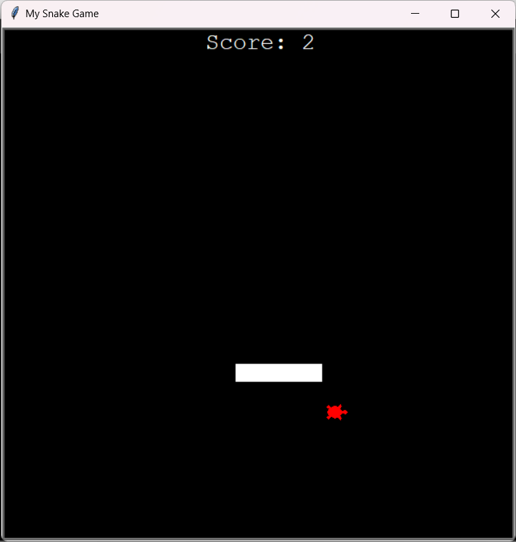

# Snake Game

This is a simple implementation of the classic Snake game using Python's Turtle module. 

## How to Play

- Use the arrow keys to control the snake's movement.
- The snake will eat the food represented by a green square.
- Each time the snake eats the food, it will grow longer.
- The game ends if the snake hits the wall or collides with itself.

## Features

- Scoreboard: Keep track of your score as you eat food and grow longer.
- Game Over: When the game ends, the scoreboard will display the final score.

## Requirements

- Python 3.x
- Turtle module

## Installation

1. Clone this repository to your local machine.
2. Ensure you have Python installed on your system.
3. Run the `snake_game.py` file using Python.

## Screenshots

## Download

You can download the executable file [here](https://drive.google.com/file/d/10c1onGGF4kFfMmrxYBdwB-S9hez6O3bD/view?usp=drive_link).

Have fun playing Snake!
